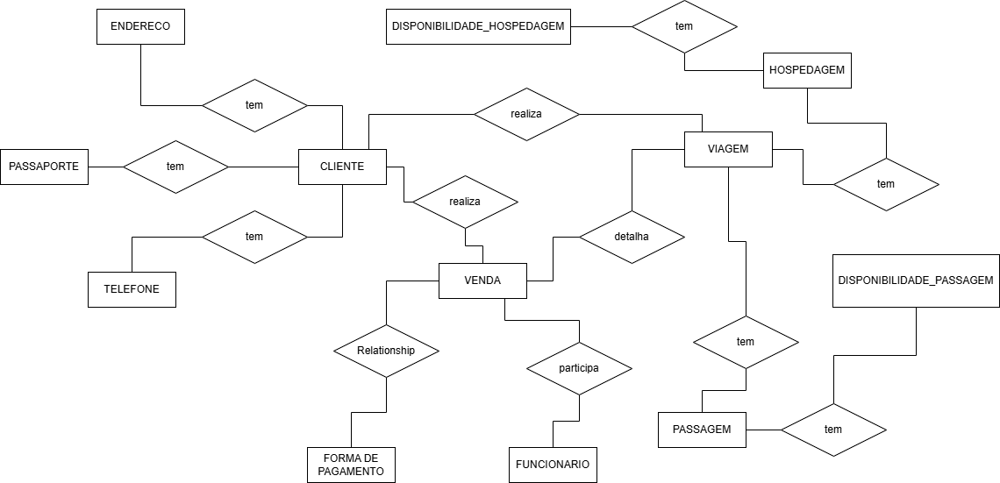
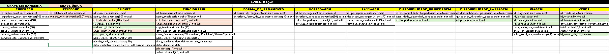
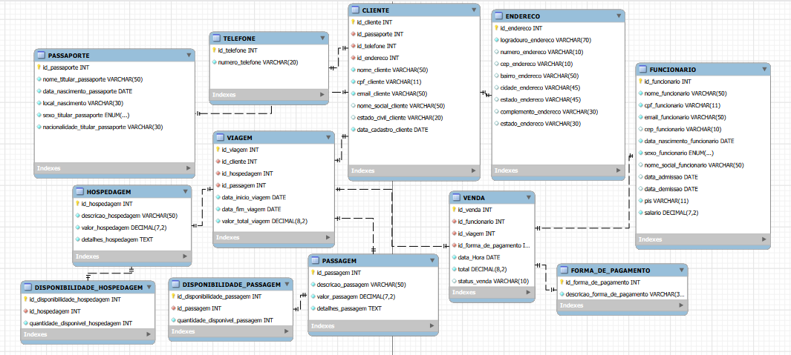

# Estudo de caso
## Horizonte Viagens

Estudo de Caso: Transformação Digital na Agência Horizonte Viagens 
Como a Centralização de Dados Impulsionou a Eficiência e o Crescimento 
Resumo Executivo 
A agência de turismo "Horizonte Viagens", uma empresa em franca expansão, enfrentava 
gargalos operacionais que ameaçavam sua escalabilidade e a qualidade do atendimento ao 
cliente. A dependência de planilhas e documentos de texto descentralizados resultava em 
ineficiência, erros de reserva e uma visão fragmentada do negócio. A implementação de um 
sistema de banco de dados relacional centralizado foi a solução estratégica para unificar as 
operações. Como resultado, a agência espera obteve um aumento expressivo na eficiência, 
uma redução drástica nos erros operacionais e fortaleceu o relacionamento com os clientes, 
estabelecendo uma base sólida para o crescimento futuro. 
1. O Cenário: Crescimento Desordenado 
A "Horizonte Viagens" consolidou-se no mercado por oferecer experiências de viagem 
personalizadas. Com o aumento da demanda, seu volume de operações cresceu 
exponencialmente. No entanto, sua infraestrutura de gestão de dados não acompanhou 
essa evolução. A agência gerenciava todas as suas informações críticas — cadastros de 
clientes, vendas de passagens aéreas e de ônibus, reservas de hotéis e a montagem de 
pacotes de viagem — utilizando um conjunto de múltiplas planilhas e documentos de texto 
isolados. O que antes era uma solução simples, tornou-se o principal obstáculo para o 
crescimento da empresa. 
2. Os Problemas: As Consequências da Fragmentação 
A falta de um sistema centralizado gerou uma série de problemas críticos que impactavam 
diretamente a produtividade, a lucratividade e a reputação da agência: 
● Dados de clientes duplicados e inconsistentes: Sem um repositório único, o 
mesmo cliente era frequentemente cadastrado várias vezes com informações 
conflitantes, dificultando a comunicação e a criação de um marketing direcionado. 
● Dificuldade para ver o histórico de um cliente: Os agentes de viagem não 
conseguiam acessar facilmente o histórico de compras e as preferências de um 
cliente. Isso resultava na perda de oportunidades para oferecer novos pacotes e 
criava uma experiência de atendimento impessoal. 
● Lentidão para montar pacotes de viagem: A criação de um pacote personalizado 
exigia a consulta manual a diversas planilhas (disponibilidade de voos, diárias de 
hotéis, etc.), um processo lento e sujeito a falhas que aumentava o tempo de espera 
do cliente. 
● Erros operacionais: O problema mais grave era a ocorrência de erros, como 
vender uma passagem ou uma diária de hotel que não estava mais disponível 
(overbooking), causando frustração nos clientes e prejuízos financeiros para a 
agência. 
● Incapacidade de gerar relatórios confiáveis: A gestão não conseguia extrair 
dados consolidados para análise. Perguntas simples como "Qual o nosso destino 
mais vendido?" ou "Qual a nossa receita mensal por tipo de serviço?" eram quase 
impossíveis de responder com precisão, impedindo uma tomada de decisão 
estratégica. 
3. A Solução: Uma Fonte Única da Verdade 
Para resolver esses desafios de forma definitiva, a solução proposta foi a criação e 
implementação de um banco de dados relacional centralizado. O objetivo era construir 
uma "fonte única da verdade" para todas as operações da agência, garantindo que toda a 
equipe, do agente de viagens ao gestor, acessasse informações consistentes e em tempo 
real. Este sistema integraria todos os módulos do negócio: gestão de clientes (CRM), 
inventário de produtos (passagens e hospedagens) e processamento de vendas. 
4. Os Benefícios: Resultados Mensuráveis 
Após a implementação do novo sistema de banco de dados, a "Horizonte Viagens" deseja 
experimentar uma transformação notável em suas operações. Os benefícios que ela espera 
obter de forma imediata e impactante, são: 
● Aumento da Eficiência: O tempo necessário para consultar dados de clientes e 
montar pacotes de viagem sejam drasticamente reduzidos. Os processos se 
tornarão mais ágeis, permitindo que os agentes atendam mais clientes com maior 
qualidade. 
● Redução Drástica de Erros: Com a validação de dados em tempo real, os casos 
de overbooking e outros erros de agendamento serão praticamente eliminados, 
aumentando a confiabilidade dos serviços prestados. 
● Melhora no Atendimento Personalizado: Com acesso instantâneo ao histórico e 
às preferências dos clientes, a equipe passará a oferecer produtos e serviços muito 
mais alinhados às suas expectativas, aumentando a satisfação e a fidelidade. 
● Base Sólida para o Crescimento: O sistema centralizado não apenas resolverá os 
problemas atuais, mas também criará uma infraestrutura escalável, pronta para 
suportar a expansão dos negócios, a adição de novos serviços e a futura integração 
com uma plataforma de vendas online. 
● Inteligência de Negócio: A capacidade de gerar relatórios precisos e instantâneos 
dará à gestão uma visão clara do desempenho da empresa, permitindo a tomada de 
decisões estratégicas baseadas em dados concretos. 
Estrutura do Banco de Dados: Horizonte Viagens 
Depois de entender o problema, foram criadas as seguintes entidades, normalizações e 
modelo lógico das tabelas:


## Modelo Conceitual
 
<p align="center">
    
</p>
 
##  Normalizações
 
<p align="center">
    
</p>

### Modelo de Entidade Relacional - Modelo Lógico
<p align="center">
    
</p>

### Modelo Físico

``` sql

CREATE DATABASE IF NOT EXISTS HORIZONTEVIAGENS;
USE HORIZONTEVIAGENS ;

-- -----------------------------------------------------
-- Table HORIZONTEVIAGENS.PASSAPORTE
-- -----------------------------------------------------
CREATE TABLE IF NOT EXISTS HORIZONTEVIAGENS.PASSAPORTE (
  id_passaporte INT NOT NULL AUTO_INCREMENT,
  nome_titular_passaporte VARCHAR(50) NOT NULL,
  data_nimento_passaporte DATE NOT NULL,
  local_nimento VARCHAR(30) NOT NULL,
  sexo_titular_passaporte ENUM("Masculino", "Feminino", "Outros") NOT NULL,
  nacionalidade_titular_passaporte VARCHAR(30) NOT NULL,
  PRIMARY KEY (id_passaporte))
ENGINE = InnoDB;


-- -----------------------------------------------------
-- Table HORIZONTEVIAGENS.ENDERECO
-- -----------------------------------------------------
CREATE TABLE IF NOT EXISTS HORIZONTEVIAGENS.ENDERECO (
  id_endereco INT NOT NULL AUTO_INCREMENT,
  logradouro_endereco VARCHAR(70) NOT NULL,
  numero_endereco VARCHAR(10) NULL,
  cep_endereco VARCHAR(10) NULL,
  bairro_endereco VARCHAR(50) NULL,
  cidade_endereco VARCHAR(45) NULL,
  estado_endereco VARCHAR(45) NULL,
  complemento_endereco VARCHAR(30) NULL,
  PRIMARY KEY (id_endereco))
ENGINE = InnoDB;


-- -----------------------------------------------------
-- Table HORIZONTEVIAGENS.TELEFONE
-- -----------------------------------------------------
CREATE TABLE IF NOT EXISTS HORIZONTEVIAGENS.TELEFONE (
  id_telefone INT NOT NULL AUTO_INCREMENT,
  numero_telefone VARCHAR(20) NOT NULL,
  PRIMARY KEY (id_telefone),
  UNIQUE INDEX numero_telefone_UNIQUE (numero_telefone ) )
ENGINE = InnoDB;


-- -----------------------------------------------------
-- Table HORIZONTEVIAGENS.CLIENTE
-- -----------------------------------------------------
CREATE TABLE IF NOT EXISTS HORIZONTEVIAGENS.CLIENTE (
  id_cliente INT NOT NULL AUTO_INCREMENT,
  id_passaporte INT NOT NULL,
  id_telefone INT NOT NULL,
  id_endereco INT NOT NULL,
  nome_cliente VARCHAR(50) NOT NULL,
  cpf_cliente VARCHAR(11) NOT NULL,
  email_cliente VARCHAR(50) NOT NULL,
  nome_social_cliente VARCHAR(50) NULL,
  estado_civil_cliente VARCHAR(20) NULL,
  data_cadastro_cliente DATE NOT NULL DEFAULT current_timestamp,
  PRIMARY KEY (id_cliente),
  UNIQUE INDEX email_cliente_UNIQUE (email_cliente ) ,
  UNIQUE INDEX cpf_cliente_UNIQUE (cpf_cliente ) ,
  INDEX fk_CLIENTE_PASSAPORTE1_idx (id_passaporte ) ,
  INDEX fk_CLIENTE_TELEFONE1_idx (id_telefone ) ,
  INDEX fk_CLIENTE_ENDERECO1_idx (id_endereco ) ,
  CONSTRAINT fk_CLIENTE_PASSAPORTE1
    FOREIGN KEY (id_passaporte)
    REFERENCES HORIZONTEVIAGENS.PASSAPORTE (id_passaporte)
    ON DELETE NO ACTION
    ON UPDATE NO ACTION,
  CONSTRAINT fk_CLIENTE_TELEFONE1
    FOREIGN KEY (id_telefone)
    REFERENCES HORIZONTEVIAGENS.TELEFONE (id_telefone)
    ON DELETE NO ACTION
    ON UPDATE NO ACTION,
  CONSTRAINT fk_CLIENTE_ENDERECO1
    FOREIGN KEY (id_endereco)
    REFERENCES HORIZONTEVIAGENS.ENDERECO (id_endereco)
    ON DELETE NO ACTION
    ON UPDATE NO ACTION)
ENGINE = InnoDB;


-- -----------------------------------------------------
-- Table HORIZONTEVIAGENS.FUNCIONARIO
-- -----------------------------------------------------
CREATE TABLE IF NOT EXISTS HORIZONTEVIAGENS.FUNCIONARIO (
  id_funcionario INT NOT NULL AUTO_INCREMENT,
  nome_funcionario VARCHAR(50) NOT NULL,
  cpf_funcionario VARCHAR(11) NOT NULL,
  email_funcionario VARCHAR(50) NOT NULL,
  cep_funcionario VARCHAR(10) NULL,
  data_nimento_funcionario DATE NOT NULL,
  sexo_funcionario ENUM("Masculino", "Feminino", "Outros") NOT NULL,
  nome_social_funcionario VARCHAR(50) NULL,
  data_admissao DATE NULL DEFAULT current_timestamp,
  data_demissao DATE NULL,
  pis VARCHAR(11) NOT NULL,
  salario DECIMAL(7,2) NOT NULL,
  PRIMARY KEY (id_funcionario),
  UNIQUE INDEX cpf_funcionario_UNIQUE (cpf_funcionario ) ,
  UNIQUE INDEX email_funcionario_UNIQUE (email_funcionario ) ,
  UNIQUE INDEX pis_UNIQUE (pis ) )
ENGINE = InnoDB;


-- -----------------------------------------------------
-- Table HORIZONTEVIAGENS.FORMA_DE_PAGAMENTO
-- -----------------------------------------------------
CREATE TABLE IF NOT EXISTS HORIZONTEVIAGENS.FORMA_DE_PAGAMENTO (
  id_forma_de_pagamento INT NOT NULL AUTO_INCREMENT,
  descricao_forma_de_pagamento VARCHAR(30) NOT NULL,
  PRIMARY KEY (id_forma_de_pagamento))
ENGINE = InnoDB;


-- -----------------------------------------------------
-- Table HORIZONTEVIAGENS.HOSPEDAGEM
-- -----------------------------------------------------
CREATE TABLE IF NOT EXISTS HORIZONTEVIAGENS.HOSPEDAGEM (
  id_hospedagem INT NOT NULL AUTO_INCREMENT,
  descricao_hospedagem VARCHAR(50) NOT NULL,
  valor_hospedagem DECIMAL(7,2) NOT NULL,
  detalhes_hospedagem TEXT NOT NULL,
  PRIMARY KEY (id_hospedagem))
ENGINE = InnoDB;


-- -----------------------------------------------------
-- Table HORIZONTEVIAGENS.PASSAGEM
-- -----------------------------------------------------
CREATE TABLE IF NOT EXISTS HORIZONTEVIAGENS.PASSAGEM (
  id_passagem INT NOT NULL AUTO_INCREMENT,
  descricao_passagem VARCHAR(50) NOT NULL,
  valor_passagem DECIMAL(7,2) NOT NULL,
  detalhes_passagem TEXT NOT NULL,
  PRIMARY KEY (id_passagem))
ENGINE = InnoDB;


-- -----------------------------------------------------
-- Table HORIZONTEVIAGENS.DISPONIBILIDADE_HOSPEDAGEM
-- -----------------------------------------------------
CREATE TABLE IF NOT EXISTS HORIZONTEVIAGENS.DISPONIBILIDADE_HOSPEDAGEM (
  id_disponibilidade_hospedagem INT NOT NULL AUTO_INCREMENT,
  id_hospedagem INT NOT NULL,
  quantidade_disponivel_hospedagem INT NOT NULL,
  PRIMARY KEY (id_disponibilidade_hospedagem),
  INDEX fk_DISPONIBILIDADE_HOSPEDAGEM_HOSPEDAGEM1_idx (id_hospedagem ) ,
  CONSTRAINT fk_DISPONIBILIDADE_HOSPEDAGEM_HOSPEDAGEM1
    FOREIGN KEY (id_hospedagem)
    REFERENCES HORIZONTEVIAGENS.HOSPEDAGEM (id_hospedagem)
    ON DELETE NO ACTION
    ON UPDATE NO ACTION)
ENGINE = InnoDB;


-- -----------------------------------------------------
-- Table HORIZONTEVIAGENS.DISPONIBILIDADE_PASSAGEM
-- -----------------------------------------------------
CREATE TABLE IF NOT EXISTS HORIZONTEVIAGENS.DISPONIBILIDADE_PASSAGEM (
  id_disponibilidade_passagem INT NOT NULL AUTO_INCREMENT,
  id_passagem INT NOT NULL,
  quantidade_disponivel_passagem INT NOT NULL,
  PRIMARY KEY (id_disponibilidade_passagem),
  INDEX fk_DISPONIBILIDADE_PASSAGEM_PASSAGEM1_idx (id_passagem ) ,
  CONSTRAINT fk_DISPONIBILIDADE_PASSAGEM_PASSAGEM1
    FOREIGN KEY (id_passagem)
    REFERENCES HORIZONTEVIAGENS.PASSAGEM (id_passagem)
    ON DELETE NO ACTION
    ON UPDATE NO ACTION)
ENGINE = InnoDB;


-- -----------------------------------------------------
-- Table HORIZONTEVIAGENS.VIAGEM
-- -----------------------------------------------------
CREATE TABLE IF NOT EXISTS HORIZONTEVIAGENS.VIAGEM (
  id_viagem INT NOT NULL AUTO_INCREMENT,
  id_cliente INT NOT NULL,
  id_hospedagem INT NOT NULL,
  id_passagem INT NOT NULL,
  data_inicio_viagem DATE NOT NULL,
  data_fim_viagem DATE NOT NULL,
  valor_total_viagem DECIMAL(8,2) NOT NULL,
  PRIMARY KEY (id_viagem),
  INDEX fk_VIAGEM_CLIENTE1_idx (id_cliente ) ,
  INDEX fk_VIAGEM_PASSAGEM1_idx (id_passagem ) ,
  INDEX fk_VIAGEM_HOSPEDAGEM1_idx (id_hospedagem ) ,
  CONSTRAINT fk_VIAGEM_CLIENTE1
    FOREIGN KEY (id_cliente)
    REFERENCES HORIZONTEVIAGENS.CLIENTE (id_cliente)
    ON DELETE NO ACTION
    ON UPDATE NO ACTION,
  CONSTRAINT fk_VIAGEM_PASSAGEM1
    FOREIGN KEY (id_passagem)
    REFERENCES HORIZONTEVIAGENS.PASSAGEM (id_passagem)
    ON DELETE NO ACTION
    ON UPDATE NO ACTION,
  CONSTRAINT fk_VIAGEM_HOSPEDAGEM1
    FOREIGN KEY (id_hospedagem)
    REFERENCES HORIZONTEVIAGENS.HOSPEDAGEM (id_hospedagem)
    ON DELETE NO ACTION
    ON UPDATE NO ACTION)
ENGINE = InnoDB;


-- -----------------------------------------------------
-- Table HORIZONTEVIAGENS.VENDA
-- -----------------------------------------------------
CREATE TABLE IF NOT EXISTS HORIZONTEVIAGENS.VENDA (
  id_venda INT NOT NULL AUTO_INCREMENT,
  id_funcionario INT NOT NULL,
  id_viagem INT NOT NULL,
  id_forma_de_pagamento INT NOT NULL,
  data_Hora DATE NOT NULL DEFAULT current_timestamp,
  total DECIMAL(8,2) NOT NULL,
  status_venda VARCHAR(10) NULL,
  PRIMARY KEY (id_venda),
  INDEX fk_VENDA_VIAGEM_idx (id_viagem ) ,
  INDEX fk_VENDA_FUNCIONARIO1_idx (id_funcionario ) ,
  INDEX fk_VENDA_FORMA_DE_PAGAMENTO1_idx (id_forma_de_pagamento ) ,
  CONSTRAINT fk_VENDA_VIAGEM
    FOREIGN KEY (id_viagem)
    REFERENCES HORIZONTEVIAGENS.VIAGEM (id_viagem)
    ON DELETE NO ACTION
    ON UPDATE NO ACTION,
  CONSTRAINT fk_VENDA_FUNCIONARIO1
    FOREIGN KEY (id_funcionario)
    REFERENCES HORIZONTEVIAGENS.FUNCIONARIO (id_funcionario)
    ON DELETE NO ACTION
    ON UPDATE NO ACTION,
  CONSTRAINT fk_VENDA_FORMA_DE_PAGAMENTO1
    FOREIGN KEY (id_forma_de_pagamento)
    REFERENCES HORIZONTEVIAGENS.FORMA_DE_PAGAMENTO (id_forma_de_pagamento)
    ON DELETE NO ACTION
    ON UPDATE NO ACTION)
ENGINE = InnoDB;

-- --------------------------------------- INSERTS ---------------------------------------------------------------------------------------------


INSERT INTO FUNCIONARIO
(nome_funcionario, cpf_funcionario, email_funcionario, cep_funcionario,
data_nimento_funcionario, sexo_funcionario, nome_social_funcionario,
data_admissao, data_demissao, pis, salario)
VALUES
('Julio Cezar Salamoni', '12345678901', 'julio.salamoni@horizonte.com', '89010000',
'2003-08-06', 'Masculino', NULL, '2022-01-10', NULL, '12345678901', 4200.00),

('Mariana Rocha', '23456789012', 'mariana.rocha@horizonte.com', '89020000',
'2005-08-22', 'Feminino', NULL, '2023-03-01', NULL, '23456789012', 3900.00),

('Gabriel Caruso', '34567890123', 'gabriel.caruso@horizonte.com', '89030000',
'2004-11-12', 'Masculino', NULL, '2024-02-15', NULL, '34567890123', 3500.00),

('Larissa Sazacalatacatis', '45678901234', 'larissa.szk@horizonte.com', '89040000',
'2004-06-27', 'Feminino', NULL, '2021-09-20', NULL, '45678901234', 4800.00),

('Alex Pinto', '56789012345', 'alex.pinto@horizonte.com', '89050000',
'2005-04-30', 'Masculino', NULL, '2020-05-18', NULL, '56789012345', 5500.00);

--

INSERT INTO FORMA_DE_PAGAMENTO
(descricao_forma_de_pagamento)
VALUES
('Dinheiro'),
('PIX'),
('Cartão de Débito'),
('Cartão de Crédito'),
('Boleto Bancário'),
('Transferência Bancária');

-- 

INSERT INTO HOSPEDAGEM
(descricao_hospedagem, valor_hospedagem, detalhes_hospedagem)
VALUES
('Hotel Copacabana Palace - Rio de Janeiro', 1450.00,
'Quarto luxo com café da manhã e vista para o mar.'),

('Hotel Fasano - São Paulo', 980.00,
'Suíte executiva com café da manhã incluso.'),

('Resort Costão do Santinho - Florianópolis', 1750.00,
'Pacote all inclusive com acesso às piscinas.'),

('Hotel Wish Foz do Iguaçu', 890.00,
'Quarto casal com café da manhã e estacionamento.'),

('Hotel Vila Galé Salvador', 760.00,
'Quarto standard com piscina e academia.');

--

INSERT INTO DISPONIBILIDADE_HOSPEDAGEM
(id_hospedagem, quantidade_disponivel_hospedagem)
VALUES
(1,20),
(2,15),
(3,10),
(4,18),
(5,25);

--

INSERT INTO PASSAGEM
(descricao_passagem, valor_passagem, detalhes_passagem)
VALUES
('São Paulo → Rio de Janeiro', 420.00,
'Voo direto com bagagem de mão inclusa.'),

('Curitiba → Florianópolis', 280.00,
'Voo econômico com duração de 50 minutos.'),

('São Paulo → Foz do Iguaçu', 560.00,
'Voo direto com bagagem despachada.'),

('Belo Horizonte → Salvador', 710.00,
'Voo com uma conexão e bagagem inclusa.'),

('Brasília → Recife', 680.00,
'Voo direto em classe econômica.');

-- 

INSERT INTO DISPONIBILIDADE_PASSAGEM
(id_passagem, quantidade_disponivel_passagem)
VALUES
(1,60),
(2,45),
(3,35),
(4,50),
(5,40);


```